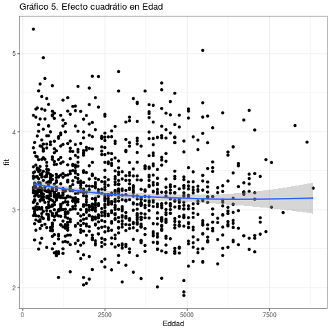

```{r setup, include=FALSE}
knitr::opts_chunk$set(comment=NA, prompt=FALSE, cache=FALSE, echo=TRUE, results='asis')

pacman::p_load(summarytools, # Tablas
               ggplot2,#Gráficos
               dplyr, #Manipulacion de datos
               car,
               sjmisc,
               citr,
               equatiomatic,
               ggpubr, #graficos
               gridExtra, #unir graficos
               fastDummies, # Crear variable dummy
               sjPlot, #Tablas y gráficos 
               texreg,
               lmtest,
               sandwich, rms, kableExtra,
               coefplot) # graficos de coeficientes


load("../project/input/data/proc/CEP_base_proc.RData") 
load("../project/input/data/proc/CEP_base_descriptivo.RData") 
load("../project/input/data/proc/CEP_base_proc_2.RData")


```

{#id .class width=30% height=30%}

#  1.	Identificación: 

Título: Gobierno y legitimidad. Análisis de regresión en la evaluación del desempeño político del gobierno.

Docente: Juan Castillo

Docente auxiliar: Valentina Andrade

Ayudante: Sebastián Cortínez Rojas

# 2. Resumen 

Actualmente existe una amplia percepción negativa sobre el funcionamiento de la democracia en Chile por parte de la ciudadanía, la cual se ve expresada en cuestiones tales como la valoración que tienen los chilenos sobre las distintas instituciones que forman parte de la democracia, tales como el gobierno, los partidos políticos o los congresistas. Se han difundido diversas teorías sobre los fenómenos que han provocado la desconexión entre la sociedad civil y las instituciones democráticas, pero en general estos estudios abordan el problema desde una perspectiva de la confianza en la institución antes que en la posición social o la falta de identidad política de los chilenos.

El siguiente trabajo se propone aportar a esta discusión y analizar si existe relación entre la identidad política, la posición social y la disposición a la regulación económica de la ciudadanía con la evaluación política del gobierno. Es por esto que surge la pregunta ¿Cuál es la relación existente entre la **percepción de la posición social, la disposición a la regularización económica** y la **identidad política** con la **evaluación del desempeño político del gobierno** en Chile en mayo del año 2019?

Se recurrió a una prueba estadística de regresión múltiple, donde los resultados muestran que efectivamente existe una relación entre la posición social, la identidad política y el índice de disposición a la regularización económica con la evaluación del desempeño político del gobierno, conformando un modelo que permite explicar, en parte, este último. Todos estos predictores resultan ser significativos estadísticamente.

# 3. Introducción 

Actualmente Chile vive una ruptura entre la institucionalidad política y la sociedad civil. Como bien es conocido, desde el punto de vista valórico, los chilenos se encuentran disociados de las instituciones y del sistema político [@garreton_gran_2016]. Según @cep_estudio_2019, casi el 50% de los chilenos considera que nuestra democracia funciona mal o muy mal, y tanto el gobierno, los partidos políticos y congreso no superan el 5% de confianza como institución.

En ese sentido, esta crisis estaría dificultando el correcto funcionamiento de las instituciones políticas, por lo que resulta relevante estudiar este fenómeno. Según @garreton_gran_2016, esta ruptura de la relación clásica entre política y sociedad estaría provocando que la sociedad pierda el sentido de la democracia como concepto básico de la organización moderna, lo que, sumado a una extrema individualización, estaría permitiendo que ciertos poderes fácticos sustituyan perversamente las instituciones.

En ese sentido, esta crisis estaría dificultando el correcto funcionamiento de las instituciones políticas, por lo que resulta relevante estudiar este fenómeno. Según @garreton_gran_2016, esta ruptura de la relación clásica entre política y sociedad estaría provocando que la sociedad pierda el sentido de la democracia como concepto básico de la organización moderna, lo que, sumado a una extrema individualización, estaría permitiendo que ciertos poderes fácticos sustituyan perversamente las instituciones.

En cuanto a antecedentes empíricos de la relación entre sociedad civil y democracia, @segovia_confianza_2008 concluye, a partir de una regresión múltiple, que los juicios de confianza sobre las instituciones dependen principalmente de su capacidad y benevolencia. En adición, el estudio de @cereceda-marambio_satisfaccion_2017 señala que la satisfacción con la democracia proviene más por confianza en instituciones y economía que por variables de orden valórico.

Aún así, generalmente estos estudios se basan en el concepto de _“confianza”_ para explicar el funcionamiento de las instituciones, pero como menciona @garreton_gran_2016, la falta de confianza no indica cómo la institución funciona, pues termina personalizándolas, siendo un concepto impreciso para explicar la ruptura entre sociedad civil e instituciones. Es por eso que, como aporte para la disciplina sociológica, este informe propone estudiar esta ruptura desde conceptos alternativos a la confianza.

Se propone estudiar cómo la autopercepción de la posición social, la identidad política y la disposición a la regulación económica se relacionan con la evaluación que hacen los sujetos del gobierno de turno. Se espera que a medida que la identidad política y la disposición a la regulación económica se alejen a la del gobierno de turno (derecha y libre mercado), la evaluación de este último disminuya. Asimismo, se espera que la posición social no tenga un efecto relevante en la evaluación del gobierno.

En esta línea, estudios psicosociales afirman que a partir del ejercicio de comparación del individuo con quienes difieren de su posición social, puede emerger un sentimiento de justicia que permite que el orden imperante sea o no legítimo para él [@adams_inequity_1965; @guienne_du_2001], pero en Chile, si bien se observa cierto malestar los grupos populares, estos no han logrado reconocerse en tanto clase para establecer un proyecto político de su interés [@bano_revista_2020]. Esto se explica porque habrían ofertas de identidades políticas fragmentadas que no se agrupan según orientaciones compartidas de clase, lo que provoca que las instituciones políticas no sean capaces de establecer nexos entre un proyecto colectivo y la posición social [@garreton_ciencias_2014; @ruiz_desigualdad_2015]. Lo anterior provocaría que la evaluación política se vea influida por relaciones clientelares, pues, al no haber un proyecto político-económico global, los gobiernos ponen en juego su legitimidad a partir de la capacidad de entrega de beneficios cortoplacistas y/o subsidios individuales [@martner_chile_2016]. Un ejemplo claro de esta relación, es el gasto en subsidios habitacionales según los gobiernos, que según @urrutia_competencia_2018, casi duplica el gasto desde el penúltimo gobierno de Piñera y el último de Bachelet. Entonces, se entiende que quienes reciban beneficios estatales estarán más dispuestos al estatismo que quienes no, y por lo tanto, evaluarían de mejor manera a los gobiernos que le otorguen tales beneficios que a los que no.


# 4. Objetivos/hipótesis 

Para guiar la investigación, se propone la siguiente pregunta:

¿Cuál es la relación existente entre la **percepción de la posición social, disposición a la regularización económica** y la **identidad política con la evaluación del desempeño político del gobierno** en Chile en mayo del año 2019?

Por lo tanto, el objetivo general de este trabajo es: Analizar la relación existente entre la percepción de la posición social, disposición a la regularización económica y la identidad política con la evaluación del desempeño político del gobierno en Chile en mayo del año 2019.

Respecto a la hipótesis, se propone que en cuanto disminuya la disposición de regularización económica (ligada a una estatista) y, en cuanto más se incline la identidad política al sector de izquierda, menor debería ser la evaluación del desempeño político del gobierno en Chile en mayo del año 2019. Asimismo, la percepción de la posición social no debería presentar mayor efecto en la variable dependiente.

En base a la anterior pregunta, se plantean los siguientes objetivos específicos:

- Caracterizar la percepción de la posición social, identidad política, disposición a la regulación económica en relación al desempeño político del gobierno en mayo del año 2019.

- Analizar cómo la evaluación del desempeño político del gobierno en mayo del año 2019 se ve afectada por la posición social, la disposición a la regulación económica y la identidad política.


# 5. Metodología  

## 5.1 Descripción de la base de datos

La base de datos a utilizar consiste en un fragmento de la base proporcionada por **CEP N°83 de Mayo del 2019**, la cual tiene como objetivo medir las actitudes y predisposiciones políticas, económicas y sociales de  los habitantes de Chile. La base está compuesta por 1380 casos y 7 variables, y su universo son todos habitantes de Chile de más de 18 años, con excepción de la Isla de Pascua. 
 

## 5.2 Variables

Para la realización de este ejercicio se tomaron en consideración las siguientes variables de la base de datos **CEP N°83 de Mayo del 2019**

**Variable dependiente:**

- **El Índice de la nota hacia el gobierno** es una variable que media entre la nota que se le asigna al gobierno por su gestión en delincuencia, pensiones, salud, educación, empleo, crecimiento económico, transporte público e inmigración. Varía del 1 al 7.

**Variables independientes:**

- **Posición Social** en la que se ubica el sujeto. Varía del 1 como nivel más bajo al 10 como nivel más alto.

- **Identidad política** refiere a la posición política a la que se siente más cercano el sujeto. Se recodifica contemplando las categorías: Derecha, Centro, Izquierda, y Ninguno.

- **Índice de disposición a la regularización económica**, este índice media entre las variables Percepción de la responsabilidad de ingresos y  Percepción de la responsabilidad de sustento. Varía del 1 al 10, donde 1 es una percepción de regularización económica estatista y 10 asociada a una posición de libre mercado.


**Variables de control:**

- **Sexo**, variable dicotómica donde posee categorias como hombre (1)  o mujer (2). 

- **Edad**, variable que representa en años la edad de la/el entrevistado.

- **Nivel de educación máximo alcanzado.** Recodificado, contempla las categorías: educación básica incompleta, educación básica completa y media incompleta, educación media completa y educación superior incompleta, educación superior completa y estudios de posgrado.


**Tabla 1. Descripción de las variables selectas**
```{r, echo=FALSE, message=FALSE, warning=FALSE, paged.print=FALSE}
print(dfSummary(CEP_base_descriptivo, headings = FALSE), method = "render")
```
**Fuente: Elaboración propia en base a CEP n°83 2019**

En la Tabla 1 se observa la distribución de las variables. Principalmente se observa que las variables selectas varían su cantidad de casos entre 1309 y 1380. La variable dependiente toma 49 valores y su distribución se asemeja a una normal, al igual que la posición social y la disposición a la regulación económica, y al contrario, la distribución de identidad política se asemeja a la de chi cuadrado.


## 5.3 Método

Se efectuará un estudio cuantitativo estadístico. En primer lugar, se propone un análisis univariado de las variables independientes y de la dependiente. Para el análisis bivariado se elaborará una correlación de las variables de interés, en conjunto a gráficos de caja. Tercero, se llevará a cabo un modelo de regresión múltiple entre las 4 variables: la identidad política, posición social, disposición a la regulación económica (independientes), y el índice de nota al desempeño del gobierno (dependiente). Finalmente se propone analizar el ajuste del modelo y su significancia estadística. Como paso final, el modelo se someterá a una evaluación de supuestos con el fin de mejorar su robustez.

Se eligió esta metodología porque permite corroborar si las variables independientes son capaces de explicar el comportamiento de la nota hacia el gobierno, y por lo tanto predecir su variación, controlando por sexo, nivel educacional y edad. Asimismo, se propone observar su ajuste para definir cuánto el modelo es capaz de explicar de la variable dependiente, como también se indica la significancia estadística para saber si los resultados son extrapolables a la población objetivo. 


# 6. Análisis de datos 

## 6.1 Análisis Univariado 

En la tabla 1, la variable _“Identidad política”_ tiene una alta concentración de casos en el número 4 (_“ninguna"_), correspondiente al 62% de los casos, indicando que las personas no suelen identificarse con algún sector político. La variable _“Índice de nota al gobierno”_ tiene una media y mediana de 3.2, y una dispersión de 1.2 lo que indica que los datos tienden a concentrarse cerca de valores medios-bajos. Por otra parte, el índice de _“disposición de regularización económica”_ tiene una mediana de 6, una media de 6.2, y una desviación estándar de 2.2, mostrando una pequeña concentración de la curva a la derecha. Sobre la variable de posición social, también existe una concentración en los casos medios-bajos, el nivel 5 con un 33.7%, seguido por las opciones de 4 y 3 con 22.5% y 15.9% respectivamente. 

Además, la variable sexo nos arroja que más de la mitad de la muestra son mujeres (62%). Por otro lado la variable nivel educacional nos muestra que al menos un 40.7% tiene educación media incompleta y de ese porcentaje, la mitad posee al menos educación básica incompleta. Finalmente, la edad evidencia una mediana de 50, es decir al menos un 50% tiene entre 18 y 50 años.


## 6.2 Análisis Bivariado

La tabla 2, nos muestra el grado de varianza compartida con las variables cuantitativas del modelo 2 (incluidas las de control, como lo es Edad), donde se evidencia la existencia de variación compartida en gran parte de las variables incluidas en la tabla. En primer lugar, se observa que tanto el índice de la nota al gobierno como el índice de disposición a la regularización económica, comparten una relación positiva y significativa estadísticamente (r=0.191, p< 0.001). En segundo lugar, se puede afirmar, que la segunda variable independiente Posición social también co-varía en relación al índice de nota al gobierno, de forma positiva y significativa (r=0.206, p<0.001). En tercer lugar, se observa una variación compartida positiva y significativa entre variables independientes, es decir el índice de disposición a la regularización económica y la Posición social (r=0.110, p<0.001), en los tres casos, se puede afirmar que resulta la relación mediano-pequeña para ciencias sociales [@cohen_statistical_1988]. Finalmente, se observa que la variable de control sólo correlaciona de forma negativa y además significativa con Posición Social (r=-0.125, p<0.001), resultando también ser una que resulta la relación mediana-pequeña para ciencias sociales [@cohen_statistical_1988].


```{r, echo=FALSE, message=FALSE, warning=FALSE, paged.print=FALSE}
M <- CEP_base_proc %>% # se especifica la base de datos
  select(ind_nota_gob, ind_disp_reg_eco, posicion_soc, Edad)  # se seleccionan las variables


tab_corr(M,                                       #dependiendo de la versión puede ser sjt.corr
         triangle = "lower",   
         title = "Tabla 2. Correlación")
```
**Fuente: Elaboración propia en base a CEP n°83 2019**


El gráfico 1 muestra la relación de la variable predictora categórica (identidad política) con la evaluación al desempeño del gobierno. Se observa; en primer lugar, que en la categoría _“Derecha”_, un 50% califica entre un 3 y un 5 (rango intercuartílico aproximado) al gobierno. En segundo lugar, la dispersión de los evaluadores de _“Centro”_ indica que un 50% tiende a calificar, en promedio, menos en relación a quienes se identifican de derecha. En tercer lugar, quienes se identifican en la _“Izquierda”_, presentando el rango intercuartílico más bajo (de 2 a 4 aproximadamente), pero con mayor dispersión, aunque sus valores extremos son más cercanos a la mediana que los demás. Finalmente, quienes se identifican con _“Ninguno”_, poseen un rango intercuartílico menos disperso que la izquierda, pero poseen una dispersión mayor en sus valores mínimos y máximos en comparación a las demás categorías.

Cabe destacar que tanto _“Izquierda”_ como _“Ninguno”_ presentan tendencias similares, pues su promedio y mediana se acercan. En ese sentido, podría ocurrir que las personas que no se identifican con ninguna identidad política suelen asociarse a opiniones de izquierda, como también que sus opiniones estén en contra de todo gobierno de turno, y por tanto, sus opiniones se asocien a la oposición de turno. Como fue mencionado anteriormente, esto último se podría explicar al entender que la ruptura entre sociedad civil e institucionalidad política ha dificultado la articulación de la sociedad en proyectos políticos colectivos, generando un malestar por la falta de capacidad de procesar las demandas por parte de la democracia, y por tanto, perdiendo el valor en ella como forma de gobierno.


```{r, echo=FALSE, message=FALSE, warning=FALSE, paged.print=FALSE}
#Grafico x2 = identidad política
plot_grpfrq(CEP_base_proc$ind_nota_gob,CEP_base_proc$identidad_pol,
            title = "Gráfico 1. Relación entre Evaluación al desempeño del gobierno e Identidad política",
            type = "box")

```

**Fuente: Elaboración propia en base a CEP n°83 2019**


## 6.3 Modelo de Regresión 

En el presente trabajo se estiman dos modelos: el primero estimado en relación al objetivo principal y el segundo  se realiza con variables de control.

**Formula teórica**
```{r results='asis', echo=FALSE}
extract_eq(reg_1)
extract_eq(reg_2)
```

**Formula de los modelos**
```{r results='asis', echo=FALSE}
extract_eq(reg_1, use_coefs = TRUE)
extract_eq(reg_2, use_coefs = TRUE)
```

La tabla 3, nos muestra dos modelos, donde los coeficientes señalan la relación existente de las variables independientes y el índice creado de evaluación al gobierno. Así en el modelo 1 la nota en promedio al gobierno es de 2.698 (cuando todos los predictores son 0)

Respecto al Modelo 1, la variable de identidad política, con la categoría Centro califica en promedio 0.136 puntos menos al gobierno en comparación a la categoría Derecha, pero **no** logra predecir significativamente el puntaje en el índice [b=-0.136, SE=0.147, p>0.05] ceteris paribus. Además, la categoría Izquierda califica en promedio 0.635 puntos menos al gobierno en comparación a la Derecha [b= -0.635, SE=0.118, p<0.001] ceteris paribus. Finalmente, se puede evidenciar que la categoría Ninguno califica en promedio 0.72 puntos menos al gobierno en comparación a la Derecha, ceteris paribus [b=-0.72, SE=0.093, p<0.001] los coeficientes de las dos últimas categorías (Izquierda y Ninguno) son significativos con un 99.9% de confianza respecto la evaluación promedio al gobierno.

Respecto al índice de disposición política a la regularización económica, se puede afirmar que predice significativamente la nota promedio al gobierno [b=0.084, SE=0.015, p<0.001] ceteris paribus, un aumento de cada punto en la disposición aumentaría un 0.084 puntos en promedio en la evaluación al gobierno.

Finalmente, respecto a la posición social se evidencia que predice significativamente la nota promedio al gobierno [b=0.128, SE=0.020, p<0.001] ceteris paribus, es decir a cada punto más de posición social la calificación aumenta 0.128 en promedio.

En el modelo 2, añadiendo las variables de control, el intercepto (nota al gobierno) en promedio aumenta (modelo 1=2.698, modelo 2=2.733), pero mantiene su significancia (p<0.001); además, se evidencia un aumento leve de los betas asociados a la posición política de Centro (-0.136 a -0.163 ), Izquierda (-0.635 a -0.665) y Ninguno (-0.720 a -0.757), manteniendo su significancia (o falta de ésta en el caso de la categoría Centro); finalmente,  aumenta el índice de disposición a la regularización económica (0.084 a 0.085) y la posición social (0.128 a 0.132) manteniendo su significancia.

Respecto a la variable de control; nivel educacional, se puede reportar que el tener educación básica completa o media incompleta califica en promedio 0.117 mejor al gobierno en comparación a no tener educación, ceteris paribus [b=0.11, SE=0.101, p>0.05]; sobre su segunda categoría se reporta que el tener educación media completa o superior incompleta significa un 0.075 de mejor nota al gobierno en comparación al no tener estudios [b=0.075, SE=0.098, p>0.05], finalmente respecto a tener educación superior completa o postgrado significa un 0.128 menos de calificación promedio al gobierno [b=-0.128, SE=0.112, p>0.05] ceteris paribus, sin embargo ni uno de los beta’s de estas categorías es estadísticamente significativo (p>0.05)

Sobre la segunda variable, se reporta que el ser mujer tiene en promedio 0.035 puntaje menos en promedio a la nota del gobierno en comparación a los hombres, ceteris paribus pero esta no resulta ser significativa [b=-0.35, SE=0.064, p>0.05]

Finalmente, respecto al reporte de la variable edad se puede interpretar que por cada año adicional se califica 0.001 menos en promedio al gobierno, ceteris paribus, pero este resultado no es significativo [b=-0.001 SE=0.002, p>0.05]

```{r echo=FALSE, message=FALSE, warning=FALSE, results='asis'}
sjPlot::tab_model(list(reg_1, reg_2),
                  show.se=TRUE,
                  show.ci=FALSE,
                  title = "Tabla 3: Modelo de regresión",
                  digits=3,
                  p.style = "stars",
                  dv.labels = c("Modelo 1", "Modelo 2"),
                  string.pred = "Predictores",
                  string.est = "β")
```
**Fuente: Elaboración propia en base a CEP n°83 2019**


El gráfico 2 evidencia que las variables identidad política de centro, las categorías de nivel educacional, sexo y edad pasan por el cero, y por ende, hay un 95% de probabilidad de que los intervalos de confianza puedan alcanzar un valor igual a 0 y que no existan diferencias, por ello no resultan significativas. No así con las categorías de identidad política izquierda y ninguno, o con el índice de disposición a la regularización social y la posición social, que muestran con un 99,9% de confianza que son distintas de 0.


```{r echo=FALSE, message=FALSE, warning=FALSE, results='asis'}
sjPlot::plot_model(reg_2,ci.lvl = c(0.95), title = "Gráfico 2. Modelo 2, coeficiente de regresión e intervalos de confianza",vline.color = "grey",line.size = 1)
```

**Fuente: Elaboración propia en base a CEP n°83 2019**

## 6.4 Ajuste global del modelo

Respecto al ajuste del modelo 1 (ver tabla 2), se puede afirmar que el modelo tiene una capacidad de explicar un 12.2% de la variación de la nota del gobierno a través de las variables identidad política, posición social y disposición en la regularización económica. En el modelo 2, la variación del R cuadrado ajustado es levemente mayor que en el modelo 1 (12,6%), lo que puede asociarse a la falta de significancia estadística de las variables de control.

# 7. Revisión de supuestos 

Para el presente informe, además se realizará una evaluación de nuestro modelo, el propósito de esto es mejorar tanto en su robustez como en su capacidad predictiva. 

## 7.1. Casos influyentes 

En el gráfico 3 se evidencia la existencia de casos influyentes, que generan cambios en la estimación de los coeficientes, estos son identificados mediante la _“Distancia de Cook”_, los cuales son aquellos casos situados por sobre la recta de corte.


```{r echo=FALSE, message=FALSE, warning=FALSE, results='asis'}
ggplot(final, aes(id, .cooksd))+
  ggtitle ("Gráfico 3. Identificación de casos influyentes") + # Título del gráfico +
  geom_bar(stat="identity", position="identity")+
  xlab("Obs. Number")+ylab("Cook's distance")+
  geom_hline(yintercept=dcook)+
  geom_text(aes(label=ifelse((.cooksd>dcook),id,"")),
            vjust=-0.2, hjust=0.5)
```

**Fuente: Elaboración propia en base a CEP n°83 2019**


Al eliminar los 64 casos influyentes, en la tabla 4, se observa en primer lugar, que el intercepto del modelo 2 [b=2.733, p<0.001] disminuye, en relación al tercer modelo [b=2.576, p<0.001], pero mantiene su significancia. En segundo lugar se puede añadir que, a excepción de edad e identidad política, los coeficientes de regresión del modelo 3 tienden a aumentar en una cantidad considerable en relación al modelo 2, aunque el sentido y la significancia estadística se mantienen. Adicionalmente, se observa una mejora en el ajuste del modelo 3 [r2 ajustado=0.190], respecto al modelo anterior [r2 ajustado=0.126], por lo tanto, para análisis posteriores se utilizará este nuevo modelo, pues contempla una mayor capacidad predictiva.

```{r echo=FALSE, message=FALSE, warning=FALSE, results='asis'}
sjPlot::tab_model(list(reg_2, reg_3),
                       show.se=TRUE,
                       show.ci=FALSE,
                       digits=3,
                       title = "Tabla 4: Modelo de regresión sin casos influyentes",
                       p.style = "stars", 
                       dv.labels = c("Modelo 2", "Modelo 3"),
                       string.pred = "Predictores",
                       string.est = "β")
```

**Fuente: Elaboración propia en base a CEP n°83 2019**

## 7.2 Linealidad 

Respecto a la linealidad, se puede observar en el gráfico 4, que no se evidencia un patrón claro en los residuos (.resid) y los valores predichos (.fitted), lo que podría dar indicios de una correcta especificación del modelo utilizado, sin embargo, en pos de mejorar la estimación del modelo, se procederá a transformar la variable Edad.

```{r echo=FALSE, message=FALSE, warning=FALSE, results='asis'}
ggplot(reg_3, aes(.fitted, .resid)) +
  ggtitle ("Gráfico 4. Distribución de residuos") + # Título del gráfico
  geom_point() +
  geom_hline(yintercept = 0) +
  geom_smooth(se = TRUE)
```

**Fuente: Elaboración propia en base a CEP n°83 2019**

En el gráfico 5, se observa que al transformar la variable edad de forma cuadrática, la recta posee una pequeña curvatura, sin embargo en su mayoría se observa una forma lineal.




**Fuente: Elaboración propia en base a CEP n°83 2019**


En la Tabla 5, se evidencia un aumento en el intercepto del modelo 3 [b=2.576, p<0.001] al modelo 4 [b=2.825, p<0.001], es decir un aumento de la nota hacía al gobierno cuando las demás constantes son 0. A pesar de ello, los demás coeficientes de regresión que resultan ser significativos para el modelo no evidencian un cambio sustancial, además se puede evidenciar que la variación de la capacidad predictiva del modelo 3 [r2 ajustado=0.190] es poca en relación al modelo 4 [r2 ajustado=0.191]. Por lo que se continuará utilizando el modelo 3 para futuros análisis 

```{r echo=FALSE, message=FALSE, warning=FALSE, results='asis'}
sjPlot::tab_model(list(reg_3, reg_4),
                       show.se=TRUE,
                       show.ci=FALSE,
                       digits=3,
                       p.style = "stars", 
                       title = "Tabla 5: Modelo de regresión con Edad cuadrática",
                       dv.labels = c("Modelo 3", "Modelo 4"),
                       string.pred = "Predictores",
                       string.est = "β",
                       custom.coef.names = labs03)
```

**Fuente: Elaboración propia en base a CEP n°83 2019**

## 7.3 Homocedasticidad

Para la revisión del presente supuesto, se utilizará en primer lugar el test Breush- Pagan, el cual nos arroja un valor p<0.05 [p=0.0006], por lo que se podría afirmar que el modelo no cumple con el supuesto y es heterocedástico al rechazar la H0, en la cual se asume que la varianza del error era constante.


```{r echo=FALSE, message=FALSE, warning=FALSE, results='asis'}
lmtest::bptest(reg_3)
```

Para reafirmar lo anterior, se utiliza también el test de Cook-Weisberg, el que corrobora los resultados de la prueba estadística anterior al arrojar valores p<0.05 [p=0.026], confirmando el rechazo de nuestra H0 y la existencia de heterocedasticidad en el modelo. En base a esto es que se realizará el cálculo de errores estándares robustos, para estimar nuestro modelo

```{r echo=FALSE, message=FALSE, warning=FALSE, results='asis'}
car::ncvTest(reg_3)

```

La tabla 6 nos muestra la creación de un modelo con errores estándares robustos, lo cual evidencia un mantención en la significancia estadística, lo que implica que nuestras estimaciones son robustas ante la presencia de heterocedasticidad en los residuos, por lo que se continuará con el tercer modelo.

```{r echo=FALSE, message=FALSE, warning=FALSE, results='asis'}
htmlreg(list(reg_3, model_robust), doctype = FALSE, p.style = "stars", caption = "Tabla 6. Modelo de regresión con errores robustos", custom.model.names = c("Modelo 4","Modelo 4Robust"), custom.coef.names = labs04)
```

**Fuente: Elaboración propia en base a CEP n°83 2019**

## 7.4 Multicolinealidad

Finalmente, a la hora de chequear el supuesto de la multicolinealidad se evidencia que en la tabla 7 sólo la variable nivel educacional en su categoría Educación media completa y superior incompleta reflejan problemas, por ser cercanas a un VIF 2.5 [VIF=2.45], sin embargo, este valor es cercano y no superior, por lo que podría aceptarse. Además, las otras variables que componen el modelo de regresión poseen valores adecuados (VIF<2.5). Por lo que se podría afirmar que  el modelo no sufre de problemas de multicolinealidad.

```{r echo=FALSE, message=FALSE, warning=FALSE, results='asis'}
kable(vif(reg_3), format = "html", caption = "Tabla 7. Prueba de colinealidad", col.names = c("VIF"))
```
**Fuente: Elaboración propia en base a CEP n°83 2019**

# 8. Conclusión 

En conclusión, según los resultados, se observa que la disposición a la regulación económica no tiene un efecto relevante en la variación de la nota que los entrevistados le asignan al desempeño político del gobierno. Por el contrario, se nota que la identidad política, en sus categorías de _“Izquierda”_ y _“Ninguna”_, impactan negativamente con una alta magnitud en la nota asignada en contraste con las demás variables. Sobre la posición social, su efecto es medianamente positivo. Es de menester evidenciar que dentro de las categorías de la variable Posición política, la categoría _"Centro"_ no resulta ser significativa, en comparación a las categorías, sobre todo a quienes se posicionan como pertenecientes a ninguna posición política. Además, se observa que estos resultados, al ser controlados por sexo, nivel educacional y edad, se mantienen similares a su estado inicial.

De las tres variables independientes escogidas, todas resultaron ser estadísticamente significativas, con un 99.9% en relación a la nota del gobierno, lo que arroja altas probabilidades de que estas diferencias ocurren dentro de los habitantes de Chile mayores de 18 años, permitiendo rechazar la hipótesis nula. Sin embargo, las variables escogidas de control, no lograron significancia estadística, lo cual limita el análisis de control.

Dicho a lo anterior, respecto a nuestra hipótesis formulada (H1), se puede afirmar que si bien la posición social presenta un impacto medianamente bajo, no termina por ser una variable irrelevante para la explicación de la nota asignada al gobierno. Asimismo, aunque mientras la disposición a la regulación económica se acerca a la tendencia del gobierno de libre mercado, la nota aumenta, la magnitud de su efecto resulta bastante menor a lo esperado. Por último, a diferencia de las otras dos variables, se cumple lo esperado en la identidad política, aunque cabe destacar que la categoría “ninguno” tiende a notas más bajas que “izquierda”, lo cual podría estar relacionado con el malestar producto de la desafección política, cuestión que podría se profundizada en un próximo estudio.

Además, respecto a la evaluación de nuestro modelo, se puede sintetizar que en primer lugar, los casos influyentes eliminados proporcionaron un mejor ajuste explicativo, mejorando su significación estadística. En segundo lugar, no se evidenció problemas de linealidad en el modelo. Tercero, que a pesar de evidenciar problemas de Heterocedasticidad, los errores del modelo eran robustos a este problema y; Finalmente, que el modelo a pesar de tener una categoría cercana al límite, en general no presentaba problemas de multicolinealidad

Entonces, si bien se cumplen las expectativas en la variación de la posición social, en su sentido teórico, los resultados demuestran que la relación clientelar establecida en Chile con la sociedad civil [@martner_chile_2016] no penetra de manera significativa en la legitimidad del desempeño político del gobierno, pues el índice de regulación económica no presenta magnitudes de alta relevancia. Asimismo, se observa que la posición política responde a la situación de malestar y de desconexión política en Chile [@bano_revista_2020; @ruiz_desigualdad_2015], tanto así, que los números de la categoría _“Ninguno”_ son los que arrojan mayor descontento, demostrando que los partidos políticos, en su calidad de identidad política, no estarían siendo capaces de asociarse con la sociedad civil. De todas formas, las cifras de la identidad política en la regresión también arrojan una magnitud menor a lo esperado. 

Dicho esto, resulta relevante profundizar en el fenómeno de la relación clientelar chilena y el Estado civil, poniendo principal énfasis en las causas de por qué en este caso sería tan baja la magnitud del índice a la regulación económica. Asimismo, queda como incógnita el vínculo entre las tendencias de _“Izquierda”_ y _“Ninguna”_, y su magnitud de los coeficientes de regresión menor al esperado. Ambos temas podrían ser nuevamente abordados en próximos estudios.


# 9. Referencias Bibliográficas


