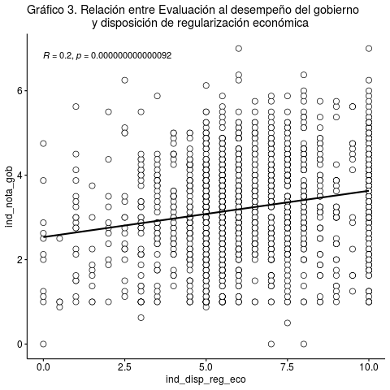

```{r setup, include=FALSE}
knitr::opts_chunk$set(comment=NA, prompt=FALSE, cache=FALSE, echo=TRUE, results='asis')

pacman::p_load(summarytools, # Tablas
               ggplot2,#Gráficos
               dplyr, #Manipulacion de datos
               car,
               sjmisc,
               citr,
               equatiomatic,
               ggpubr, #graficos
               gridExtra, #unir graficos
               fastDummies, # Crear variable dummy
               sjPlot, #Tablas y gráficos 
               coefplot) # graficos de coeficientes

remotes::install_github("datalorax/equatiomatic")

load("/cloud/project/input/data/proc/CEP_base_proc.RData") 
load("/cloud/project/input/data/proc/CEP_base_descriptivo.RData") 

```

{#id .class width=30% height=30%}

#  1.	Identificación: 

Tema: Legitimidad política 

Docente: Juan Castillo

Fecha:  de julio del 2020

# 2. Resumen 
En la actualidad existe una percepción de mal funcionamiento de la democracia por parte de la ciudadanía, la cual se relega a componentes de ésta como el gobierno, los partidos políticos y el congreso, los cuales no son instituciones o un sistema de confianza para los chilenos (CEP, 2019). Por ende, esta disociación entre ciudadanía e institucionalidad política conlleva a fenómenos como la baja participación electoral y un desentendimiento los procesos políticos ciudadanos.

Es por este fenómeno, que nuestra pregunta de investigación busca conocer ¿Cuál es la relación existente entre la percepción de la posición social y la identidad política con la evaluación del desempeño político del gobierno en Chile en mayo del año 2019?. Por consiguiente el objetivo general de este trabajo es: Analizar la relación existente entre la percepción de la posición social y la identidad política con la evaluación del desempeño político del gobierno en Chile en mayo del año 2019.

Para esto se utilizará la base de datos de la encuesta CEP n°83 del periodo de mayo del 2019, la cual busca representar a la población de todo chile a través de una muestra con 1380 casos.
El resultado principal de esta investigación es que efectivamente, tanto la posición social, la identidad política y el índice de disposición a la regularización económica, reflejan una relación y logran explicar como modelo la evaluación hacia el gobierno, donde todos estos predictores resultan ser significativos estadísticamente, es decir extrapolables a la población.


# 3. Introducción 

Actualmente Chile vive una ruptura entre la institucionalidad política y la sociedad civil. Como bien es conocido, desde el punto de vista valórico, los chilenos se encuentran disociados de las instituciones y del sistema político [@garreton_gran_2016]. Según @cep_estudio_2019, casi el 50% de los chilenos considera que nuestra democracia funciona mal o muy mal, y tanto el gobierno, los partidos políticos y congreso no superan el 5% de confianza como institución.

En ese sentido, esta crisis estaría dificultando el correcto funcionamiento de las instituciones políticas, por lo que resulta relevante estudiar este fenómeno. Según @garreton_gran_2016, esta ruptura de la relación clásica entre política y sociedad estaría provocando que la sociedad pierda el sentido de la democracia como concepto básico de la organización moderna, lo que, sumado a una extrema individualización, estaría permitiendo que ciertos poderes fácticos sustituyan perversamente las instituciones.

En cuanto a antecedentes empíricos, @segovia_confianza_2008 concluye, a partir de una regresión múltiple, que los juicios de confianza sobre las instituciones dependen principalmente de su capacidad y benevolencia. En adición, el estudio de @cereceda-marambio_satisfaccion_2017 señala que la satisfacción con la democracia proviene más por confianza en instituciones y economía que por variables de orden valórico.

Aún así, generalmente estos estudios se basan en el concepto de “confianza” para explicar el funcionamiento de las instituciones, pero como menciona @garreton_gran_2016, la falta de confianza no indica cómo la institución funciona, pues termina personalizándolas, siendo un concepto impreciso para explicar la ruptura entre sociedad civil e instituciones. Es por eso que, como aporte para la disciplina sociológica, este informe propone estudiar esta ruptura desde conceptos alternativos a la confianza.

Se propone estudiar cómo la autopercepción de la posición social y la identidad política se relacionan con la evaluación que hacen los sujetos del gobierno de turno, entendiendo esta última como la nota que se asigna al rendimiento del gobierno en ciertas materias de discusión pública. Se espera que a medida que la posición social baje, se aleje la identidad política a la del gobierno de turno, y que la evaluación de este último disminuya.

En esta línea, estudios psicosociales afirman que a partir del ejercicio de comparación del individuo con quienes difieren de su posición social, puede emerger un sentimiento de justicia que permite que el orden imperante sea o no legítimo para él (Adams, 1965; Guienne, 2001). 
En relación con Chile, Baño (2019) menciona que la institucionalidad política ha marginado a los sectores populares de sus decisiones, provocando cierto malestar en estos grupos. Por otro lado, @ruiz_desigualdad_2015 and @garreton_ciencias_2014 entienden que habrían ofertas de identidades políticas fragmentadas que no se agrupan según orientaciones colectivas compartidas de clase, lo que provoca que los partidos e instituciones políticas no sean capaces de establecer nexos entre un proyecto colectivo y la posición social.


# Objetivos/hipótesis 

Para guiar la investigación, se propone la siguiente pregunta:

¿Cuál es la relación existente entre la percepción de la posición social y la identidad política con la evaluación del desempeño político del gobierno en Chile en mayo del año 2019?

Por lo tanto, el objetivo general de este trabajo es: Analizar la relación existente entre la percepción de la posición social y la identidad política con la evaluación del desempeño político del gobierno en Chile en mayo del año 2019.

Respecto a la hipótesis, se propone que en cuanto aumente la percepción de la posición  social de los individuos, y, en cuanto más se incline la identidad política al sector de derecha, mayor debería ser la evaluación del desempeño político del gobierno en Chile en mayo del año 2019.

Para responder la anterior pregunta y poner a prueba la posible respuesta a ella se plantean los siguientes objetivos específicos:

- Construir un índice, a partir de datos, de la evaluación del desempeño político del gobierno en mayo del año 2019.

- Caracterizar la percepción de la posición social, identidad política, disposición a la regulación económica y desempeño político del gobierno en mayo del año 2019.

- Analizar la posición social, disposición a la regulación económica e identidad política en la evaluación del desempeño político del gobierno en mayo del año 2019.

- Conocer cómo afectan la edad, el sexo y el nivel educacional en la relación de la posición social, disposición a la regulación económica e identidad política con la evaluación del desempeño político del gobierno en mayo del año 2019.

# Metodología  

## 3.1 Descripción de la base de datos

La base de datos a utilizar [CEP_base_proc] consiste en un fragmento de la base proporcionada por CEP (2019), la cual tiene como objetivo medir las actitudes y predisposiciones políticas, económicas y sociales de los habitantes de Chile. La base CEP_base_proc está compuesta por 1380 casos y 7 variables.

## 3.2 Variables

Para la realización de este ejercicio se tomaron en consideración las siguientes variables de la base de datos CEP_base_poc.

- [posición_soc] = Nivel del grupo en el que se ubica el sujeto. Varía del 1 como nivel más bajo al 10 como nivel más alto.

- [identidad_pol] = Posición política a la que se siente más cercano el sujeto. Contempla las categorías: Derecha, Centro derecha, Centro, Centro izquierda, Izquierda, Independiente y Ninguno.

- [ind_dips_reg_eco] = media entre las variables “perc_resp_ing” (percepción de la responsabilidad de ingresos) y  “perc_resp_sus” (percepción de la responsabilidad de sustento). Varía del 1 al 10. Donde 1 se relaciona con una percepción de regularización económica estatista y 10 con una de índole liberal.

- [ind_nota_gob] = Media entre la nota que se le asigna al gobierno por su gestión en delincuencia, pensiones, salud, educación, empleo, crecimiento económico, transporte público e inmigración. Varía del 1 al 7.

- [sexo] = Si es hombre o mujer.

- [Edad] = Posición política a la que se siente más cercano el sujeto. Contempla las categorías: Derecha, Centro derecha, Centro, Centro izquierda, Izquierda e Independiente.
 
- [nivel_educ] = Nivel de educación máximo alcanzado. Contempla las categorías: educación básica incompleta, educación básica completa, educación media incompleta, educación media completa, educación superior no universitaria incompleta, educación superior no universitaria completa, educación superior universitaria incompleta, educación superior universitaria completa y estudios de posgrado.

Antes de pasar a describir las variables, cabe explicar que la variable “índice de nota al gobierno” fue construida a partir de un promedio de la nota del 1 al 7 que registraban los entrevistados en la gestión del gobierno en delincuencia, pensiones, salud, educación, empleo, crecimiento económico, transporte público e inmigración. Asimismo, la variable “disposición a la regulación económica” fue construida a partir de las variables “percepción de la responsabilidad de ingresos” y “percepción de la responsabilidad del sustento”, que variaban del 1 al 10.


**Tabla 1. Descriptivos**
```{r, echo=FALSE, message=FALSE, warning=FALSE, paged.print=FALSE}
print(dfSummary(CEP_base_descriptivo, headings = FALSE), method = "render")
```
**Fuente: Elaboración propia en base a CEP n°83 2019**

Respecto a la tabla 1, se puede observar que, en la variable “Identidad política”, existe una concentración de casos en el número 7, correspondiendo al 62% de la muestra, concentrando un 8% y 8,3% las opciones de respuesta 5 y 1 respectivamente. Por otra parte, la desviación estándar para la variable en cuestión es de 2,1 y el coeficiente de variación de un 0,4.

En segundo lugar, la variable “Índice de nota al gobierno” tiene una mediana de 3.2, señalando que el 50% de la muestra posee ese valor o más. Cabe señalar que la media es igualmente de 3.2 por lo cual la muestra se distribuye de manera igual a ambos lados del promedio. Adicionalmente, se puede observar que la desviación estándar para esta variable es de 1,2 y un 0,4 en el coeficiente de variación. 

Por otra parte, el índice de disposición de regularización económica se caracteriza por poseer una mediana de 6, significando que el 50% de los casos se ubican a partir de 6 o más. Por otra parte, la media señala con 6.2 que existe una tendencia de la curva a la derecha. Respecto a la dispersión la muestra posee una desviación estándar de 2.2.

Finalmente, La variable de posición social, se puede apreciar que existe una mayor concentración en el nivel 5 con un 33.7%, seguido por las opciones de 4 y 3 con 22,5% y 15,9% respectivamente. El 50% de la muestra se concentra a partir de la opción número 5 o más, con una desviación estándar de 1.5.

## 3.3 Método

Respecto de los métodos a utilizar en esta investigación, se efectuará un estudio cuantitativo estadístico. En primer lugar, se elaborará una correlación entre las variables a analizar. En segundo lugar, se llevará a cabo un modelo de regresión múltiple que relacione las variables. Las variables independientes serán la identidad política, posición social y disposición a la regulación económica. La variable dependiente consistirá en un índice de nota al gobierno. Teniendo estos procesos estadísticos realizados, se procederá a sacar conclusiones a partir de una significación estadística que aporten a responder la hipótesis planteada. 

Esta metodología se eligió porque nos va corroborar si las variables independientes pueden o no explicar la variación de la nota hacia el gobierno y si las variaciones planteadas en el modelo son distintas de 0, es decir, la posibilidad de que se pueda afirmar con una confianza estimada si las variaciones compartidas se pueden extrapolar o no a la población, en este caso a Chile; es por esto que nos centraremos en la regresión múltiple, su valor p y el ajuste del modelo (R2 ajustado). 


# 4. Análisis de datos 

## 4.1 Análisis Descriptivo 

En el análisis se da una relación compartida de la nota hacia el gobierno (nuestra variable independiente) con la posición social, identidad política y la disposición hacia la regularización económica.

El gráfico 1 nos muestra la relación con nuestra primera variable independiente: posición social, donde se da una correlación positiva (0.21, p<0.001) respecto a la variación que posee el índice de la nota hacia el gobierno, es decir, correlaciona de forma directa, por ejemplo un alza en la variación de la nota se relaciona con un alza en la variación de la posición social.


**Fuente: Elaboración propia en base a CEP n°83 2019**


Respecto al gráfico 2, se puede observar un gráfico de cajas por la naturaleza de la variable identidad política (categórica)

```{r, echo=FALSE, message=FALSE, warning=FALSE, paged.print=FALSE}
#Grafico x2 = identidad política
plot_grpfrq(CEP_base_proc$ind_nota_gob,CEP_base_proc$identidad_pol,
            title = "Gráfico 2. Relación entre nota al gobierno e Identidad política",
            type = "box")

```

**Fuente: Elaboración propia en base a CEP n°83 2019**


Finalmente, el gráfico 3 nos muestra la relación conjunta de la nota al gobierno y la disposición a la regularización económica, donde se da una correlación positiva (0.2, p<0.001) es decir, un alza en una se ve reflejado en un alza en la variación de la otra; por ejemplo un alza en la nota hacia el gobierno refleja una disposición a una regularización económica de índole más liberal.




**Fuente: Elaboración propia en base a CEP n°83 2019** 

## 4.2 Modelo de Regresión 

En el presente trabajo se estiman dos modelos, el primero es estimado en relación al objetivo principal y el segundo modelo se realiza con las variables de control.


```{r results='asis', echo=FALSE}
extract_eq(reg_1)
extract_eq(reg_2)
```

```{r results='asis', echo=FALSE}
extract_eq(reg_1, use_coefs = TRUE)
extract_eq(reg_2, use_coefs = TRUE)
```


La tabla 2, nos muestra dos modelos, donde los coeficientes señalan la relación existente de las variables independientes y el índice creado de evaluación al gobierno. Así en el modelo 1 la nota en promedio al gobierno es de 2.698

Respecto al Modelo 1, se puede afirmar en primer lugar respecto a la variable de identidad política que; la categoría asociada al centro califica en promedio 0.136 menos al gobierno en comparación a la identidad política de derecha, pero no logra predecir significativamente el puntaje en el índice [b=-0.136, SE=0.147, p>0.05] ceteris paribus. Así la identidad política de izquierda califica en promedio 0.635 puntos menos al gobierno en comparación a la derecha [b= -0.635, SE=0.118, p<0.001] ceteris paribus. Finalmente, se puede evidenciar que la posición política ninguno califica en promedio 0.72 puntos menos al gobierno en comparación a la identidad política de derecha, ceteris paribu [b=-0.72, SE=0.093, p<0.001] los coeficientes de las dos últimas categorías (izquierda y ninguno) son significativos con un 99.9% de confianza respecto la nota promedio hacia el gobierno.

Respecto a la segunda variable del modelo 1, se puede afirmar que el índice de disposición política a la regularización económica predice significativamente la nota promedio al gobierno [b=0.084, SE=0.015, p<0.001] ceteris paribus, un aumento de cada punto en la disposición aumenta un 0.084 puntos en promedio a la nota al gobierno.

Finalmente, respecto a la tercera variable del modelo 1, se puede afirmar que la posición social predice significativamente la nota promedio al gobierno [b=0.128, SE=0.020, p<0.001] ceteris paribus, es decir a cada punto más de posición social la calificación aumenta 0.128 en promedio.

Al momento de añadir las variables de control, la nota al gobierno en promedio aumenta (modelo 1=2.698, modelo 2=2.733), pero el intercepto mantiene su significancia (p<0.001). También se puede añadir que aumentan levemente los betas asociados a la posición política de centro (-0.136 a -0.163 ), izquierda (-0.635 a -0.665) y ninguno (-0.720 a -0.757), manteniendo su significancia (o falta de ésta en el caso de la posición política de centro), de la misma forma aumenta el índice de disposición a la regularización económica (0.084 a 0.085) y la posición social (0.128 a 0.132) manteniendo su significancia.

Respecto a la primera variable de control añadida al modelo 2; nivel educacional, se puede reportar que el tener educación básica completa o media incompleta califica en promedio 0.117 mejor al gobierno en comparación a no tener educación, ceteris paribus [b=0.11, SE=0.101, p>0.05]; sobre su segunda categoría se reporta que el tener educación media completa o superior incompleta significa un 0.075 de mejor nota al gobierno en comparación al no tener estudios [b=0.075, SE=0.098, p>0.05], finalmente respecto a tener educación superior completa o postgrado significa un 0.128 menos de calificación promedio al gobierno [b=-0.128, SE=0.112, p>0.05] ceteris paribus, sin embargo ni uno de los beta’s de estas categorías es estadísticamente significativo (p>0.05)

Sobre la segunda variable, se reporta que el ser mujer tiene en promedio 0.035 puntaje menos en promedio a la nota del gobierno en comparación a los hombres, ceteris paribus pero esta no resulta ser significativa [b=-0.35, SE=0.064, p>0.05]

Finalmente, respecto al reporte de la variable edad se puede interpretar que por cada año adicional se califica 0.001 menos en promedio al gobierno, ceteris paribus, pero este resultado no es significativo [b=-0.001 SE=0.002, p>0.05]


```{r echo=FALSE, message=FALSE, warning=FALSE, results='asis'}
sjPlot::tab_model(list(reg_1, reg_2),
                  show.se=TRUE,
                  show.ci=FALSE,
                  title = "Tabla 2: Modelo de regresión",
                  digits=3,
                  p.style = "stars",
                  dv.labels = c("Modelo 1", "Modelo 2"),
                  string.pred = "Predictores",
                  string.est = "β")
```
**Fuente: Elaboración propia en base a CEP n°83 2019**


La significancia de los coeficientes se puede evidenciar en el gráfico 4, que nos muestra que las variables identidad política de centro, todas las categorías de nivel educacional, sexo y edad pasan por el cero, por ende, hay una probabilidad (al 95%) de que las diferencias expresadas en los intervalos de confianza puedan alcanzar un valor igual a 0, por ello no resultan ser significativas. No así con las variables identidad política de izquierda y ninguno, o con el índice de disposición a la regularización social y la posición social, con las que se puede afirmar con un 95% de confianza que son distintas de 0.


```{r echo=FALSE, message=FALSE, warning=FALSE, results='asis'}
sjPlot::plot_model(reg_2,ci.lvl = c(0.95), title = "Gráfico 4. Modelo 2, coeficiente de regresión e intervalos de confianza",vline.color = "grey",line.size = 1)

```

## 4.3 Ajuste global del modelo

Respecto al ajuste del modelo 1, se puede evidenciar que el ajuste del modelo es de un 12.2% (R2 ajustado), es decir, se puede explicar en un 12.2%  la varianza de la nota del gobierno a través de las variables identidad política, posición social y el índice a la disposición en la regularización económica. En el modelo 2, la variación que tiene el R cuadrado ajustado es leve (de 12.2% a un 12.6%), pero mayor que en el modelo 1, esto puede verse relacionado con la falta de significancia estadística de las variables de control.

# 5. Conclusión 

En síntesis se da que las tres variables predictoras escogidas (identidad política, índice de disposición a la regularización económica y la posición social) resultaron ser significativas en la predicción de variación en relación a la nota del gobierno. Es decir son variables predictoras del fenómeno, pero que en su relación (sea negativa o positiva) están sujetas al contexto, con ello nos referimos por ejemplo a la posición política que el gobierno posea, en esta encuesta toma, es el gobierno de Sebastián Piñera, para ejemplificar, esto es que se ve una relación de índole negativa en la categoría de posición política de izquierda.  

Respecto a nuestra hipótesis formulada (H1), se puede afirmar, es decir que en cuanto aumenta la percepción de la posición social aumentará la evaluación en el desempeño político, la misma lógica sigue la identidad política, mientras más ligada está a la derecha tenderá a tener mejores calificaciones en comparación a sectores de izquierda. Finalmente, mientras mayor sea la disposición a una regularización económica liberal (menos estatista) mejor será la evaluación del desempeño que ha realizado el gobierno 

Finalmente, las tres variables escogidas resultaron ser estadísticamente significativas, con un 99.9% en relación a la nota del gobierno, esto nos arroja una probabilidad muy alta de que estas diferencias se den en la población realmente, pudiendo rechazar la hipótesis nula. Sin embargo, las variables escogidas de control, no lograron significancia estadística, lo cual limita un análisis más amplio, a pesar de ello esto debe considerarse a la hora de realizar estudios a futuro 


# Referencias Bibliográficas
