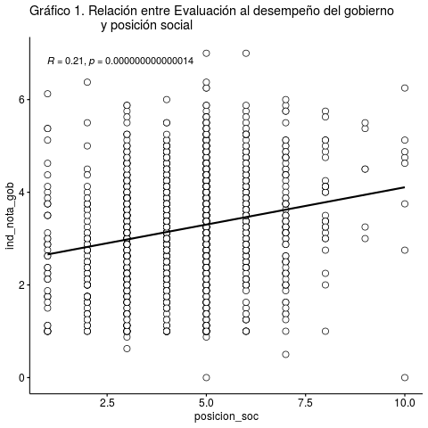

```{r setup, include=FALSE}
knitr::opts_chunk$set(comment=NA, prompt=FALSE, cache=FALSE, echo=TRUE, results='asis')

pacman::p_load(summarytools, # Tablas
               ggplot2,#Gráficos
               dplyr, #Manipulacion de datos
               car,
               sjmisc,
               citr,
               equatiomatic,
               ggpubr, #graficos
               gridExtra, #unir graficos
               fastDummies, # Crear variable dummy
               sjPlot, #Tablas y gráficos 
               coefplot) # graficos de coeficientes

remotes::install_github("datalorax/equatiomatic")

load("/cloud/project/input/data/proc/CEP_base_proc.RData") 
load("/cloud/project/input/data/proc/CEP_base_descriptivo.RData") 

```

{#id .class width=30% height=30%}

#  1.	Identificación: 

Tema: Legitimidad política y posición social

Docente: Juan Castillo

Fecha:  del 2020

# 2. Resumen 

# 3. Introducción (466/500 palabras)

Actualmente Chile vive una ruptura entre la institucionalidad política y la sociedad civil. Como bien es conocido, desde el punto de vista valórico, los chilenos se encuentran disociados de las instituciones y del sistema político (Garretón, 2016). Según CEP (2019), casi el 50% de los chilenos considera que nuestra democracia funciona mal o muy mal, y tanto el gobierno, los partidos políticos y congreso no superan el 5% de confianza como institución.

En ese sentido, esta crisis estaría dificultando el correcto funcionamiento de las instituciones políticas, por lo que resulta relevante estudiar este fenómeno. Según Garretón (2016), esta ruptura de la relación clásica entre política y sociedad estaría provocando que la sociedad pierda el sentido de la democracia como concepto básico de la organización moderna, lo que, sumado a una extrema individualización, estaría permitiendo que ciertos poderes fácticos sustituyan perversamente las instituciones.

En cuanto a antecedentes empíricos, Segovia, et al. (2008) concluye, a partir de una regresión múltiple, que los juicios de confianza sobre las instituciones dependen principalmente de su capacidad y benevolencia. En adición, el estudio de Cereceda-Marambio & Torres-Solís (2017) señala que la satisfacción de la democracia proviene más por confianza en instituciones y economía que por variables de orden valórico.

Aún así, generalmente estos estudios se basan en el concepto de “confianza” para explicar el funcionamiento de las instituciones, pero como menciona Garretón (2016), la falta de confianza no indica cómo la institución funciona, pues termina personalizándolas, siendo un concepto impreciso para explicar la ruptura entre sociedad civil e instituciones. Es por eso que, como aporte para la disciplina sociológica, este informe propone estudiar esta ruptura desde conceptos alternativos a la confianza.

Se propone estudiar cómo la autopercepción de la posición social y la identidad política se relacionan con la evaluación que hacen los sujetos del gobierno de turno, entendiendo esta última como la nota que se asigna al rendimiento del gobierno en ciertas materias de discusión pública. Se espera que a medida que disminuya la posición social y se aleje la identidad política a la del gobierno de turno, la evaluación de este último disminuya.

En esta línea, estudios psicosociales afirman que a partir del ejercicio de comparación del individuo con quienes difieren de su posición social, puede emerger un sentimiento de justicia que permite que el orden imperante sea o no legítimo para él (Adams, 1965; Guienne, 2001). 

En relación con Chile, Baño (2019) menciona que la institucionalidad política ha marginado a los sectores populares de sus decisiones, provocando cierto malestar en estos grupos. Por otro lado, Ruiz (2015) & Garretón (2014) entienden que habrían ofertas de identidades políticas fragmentadas que no se agrupan según orientaciones colectivas compartidas de clase, lo que provoca que los partidos e instituciones políticas no sean capaces de establecer nexos entre un proyecto colectivo y la posición social.

# Objetivos/hipótesis (257 /250 palabras)
Para guiar la investigación, se propone la siguiente pregunta:
¿Cuál es la relación existente entre la percepción de la posición social y la identidad política con la evaluación del desempeño político del gobierno en Chile en mayo del año 2019?
Por lo tanto, el objetivo general de este trabajo es: Analizar la relación existente entre la percepción de la posición social y la identidad política con la evaluación del desempeño político del gobierno en Chile en mayo del año 2019.
Respecto a la hipótesis, se propone que en cuanto aumente la percepción de la posición  social de los individuos, y, en cuanto más se incline la identidad política al sector de derecha, mayor debería ser la evaluación del desempeño político del gobierno en Chile en mayo del año 2019.
Para responder la anterior pregunta y poner a prueba la posible respuesta a ella se plantean los siguientes objetivos específicos:
Construir un índice, a partir de datos, de la evaluación del desempeño político del gobierno en mayo del año 2019
Caracterizar la percepción de la posición social, identidad política, disposición a la regulación económica y desempeño político del gobierno en mayo del año 2019.
Analizar la posición social, disposición a la regulación económica e identidad política en la evaluación del desempeño político del gobierno en mayo del año 2019.
Conocer cómo afectan la edad, el sexo y el nivel educacional en la relación de la posición social, disposición a la regulación económica e identidad política con la evaluación del desempeño político del gobierno en mayo del año 2019.


# Metodología  (263/500 palabras)

##3.1 Descripción de la base de datos

La base de datos a utilizar [CEP_base_proc] consiste en un fragmento de la base proporcionada por CEP (2019), la cual tiene como objetivo medir las actitudes y predisposiciones políticas, económicas y sociales de los habitantes de Chile. La base CEP_base_proc está compuesta por 1380 casos y 7 variables.

##3.2 Variables

Para la realización de este ejercicio se tomaron en consideración las siguientes variables de la base de datos CEP_base_poc.

[posición_soc] = Nivel del grupo en el que se ubica el sujeto. Varía del 1 como nivel más bajo al 10 como nivel más alto.

[identidad_pol] = Posición política a la que se siente más cercano el sujeto. Contempla las categorías: Derecha, Centro derecha, Centro, Centro izquierda, Izquierda, Independiente y Ninguno.

[ind_dips_reg_eco] = media entre las variables “perc_resp_ing” (percepción de la responsabilidad de ingresos) y  “perc_resp_sus” (percepción de la responsabilidad de sustento). Varía del 1 al 10.

[ind_nota_gob] = Media entre la nota que se le asigna al gobierno por su gestión en delincuencia, pensiones, salud, educación, empleo, crecimiento económico, transporte público e inmigración. Varía del 1 al 7.

[sexo] = Si es hombre o mujer (1=hombre 2=mujer).

[Edad] = Posición política a la que se siente más cercano el sujeto. Contempla las categorías: Derecha, Centro derecha, Centro, Centro izquierda, Izquierda e Independiente.

[nivel_educ] = Nivel de educación máximo alcanzado. Contempla las categorías: educación básica incompleta, educación básica completa, educación media incompleta, educación media completa, educación superior no universitaria incompleta, educación superior no universitaria completa, educación superior universitaria incompleta, educación superior universitaria completa y estudios de posgrado.

Antes de pasar a describir las variables, cabe explicar que la variable “índice de nota al gobierno” fue construida a partir de un promedio de la nota del 1 al 7 que registraban los entrevistados en la gestión del gobierno en delincuencia, pensiones, salud, educación, empleo, crecimiento económico, transporte público e inmigración. Asimismo, la variable “disposición a la regulación económica” fue construida a partir de las variables “percepción de la responsabilidad de ingresos” y “percepción de la responsabilidad del sustento”, que variaban del 1 al 10.


**Tabla 1. Descriptivos**
```{r, echo=FALSE, message=FALSE, warning=FALSE, paged.print=FALSE}
print(dfSummary(CEP_base_descriptivo, headings = FALSE), method = "render")
```
**Fuente: Elaboración propia en base a CEP n°83 2019**

Respecto a la tabla 1, se puede observar que, en la variable “Identidad política”, existe una concentración de casos en el número 7, correspondiendo al 62% de la muestra, concentrando un 8% y 8,3% las opciones de respuesta 5 y 1 respectivamente. Por otra parte, la desviación estándar para la variable en cuestión es de 2,1 y el coeficiente de variación de un 0,4.

En segundo lugar, la variable “Índice de nota al gobierno” tiene una mediana de 3.2, señalando que el 50% de la muestra posee ese valor o más. Cabe señalar que la media es igualmente de 3.2 por lo cual la muestra se distribuye de manera igual a ambos lados del promedio. Adicionalmente, se puede observar que la desviación estándar para esta variable es de 1,2 y un 0,4 en el coeficiente de variación. 

##3.3 Método

Respecto de los métodos a utilizar en esta investigación, se efectuará un estudio cuantitativo estadístico. En primer lugar, se elaborará una correlación entre las variables a analizar. En segundo lugar, se llevará a cabo un modelo de regresión múltiple que relacione las variables. Las variables independientes serán la identidad política, posición social y disposición a la regulación económica. La variable dependiente consistirá en un índice de nota al gobierno. Teniendo estos procesos estadísticos realizados, se procederá a sacar conclusiones a partir de una significación estadística que aporten a responder la hipótesis planteada. falta el pq se eligio esto, y cuales son las operaciones centrales para la hipotesis


# Análisis de datos (0/1000 palabras)

##4.1 Análisis Descriptivo 



**Fuente: Elaboración propia en base a CEP n°83 2019**


```{r, echo=FALSE, message=FALSE, warning=FALSE, paged.print=FALSE}
#Grafico x2 = identidad política
plot_grpfrq(CEP_base_proc$ind_nota_gob,CEP_base_proc$identidad_pol,
            title = "Gráfico 2. Relación entre nota al gobierno e Identidad política",
            type = "box")

```

**Fuente: Elaboración propia en base a CEP n°83 2019**


**Fuente: Elaboración propia en base a CEP n°83 2019** 

## 4.2 Modelo de Regresión 

En el presente trabajo se estiman dos modelos, el primero es estimado en relación al objetivo principal y el segundo modelo se realiza con las variables de control.

**fórmula

```{r results='asis', echo=FALSE}
extract_eq(reg_1)
extract_eq(reg_2)
```

```{r results='asis', echo=FALSE}
extract_eq(reg_1, use_coefs = TRUE)
extract_eq(reg_2, use_coefs = TRUE)
```


```{r echo=FALSE, message=FALSE, warning=FALSE, results='asis'}
sjPlot::tab_model(list(reg_1, reg_2),
                  show.se=TRUE,
                  show.ci=FALSE,
                  title = "Tabla 2: Modelo de regresión",
                  digits=3,
                  p.style = "stars",
                  dv.labels = c("Modelo 1", "Modelo 2"),
                  string.pred = "Predictores",
                  string.est = "β")
```
**Fuente: Elaboración propia en base a CEP n°83 2019**


```{r echo=FALSE, message=FALSE, warning=FALSE, results='asis'}
sjPlot::plot_model(reg_2,ci.lvl = c(0.95), title = "Gráfico 4. Modelo 2, coeficiente de regresión e intervalos de confianza",vline.color = "grey",line.size = 1)

```

# Conclusión (0/150 palabras)

# Referencias Bibliográficas
